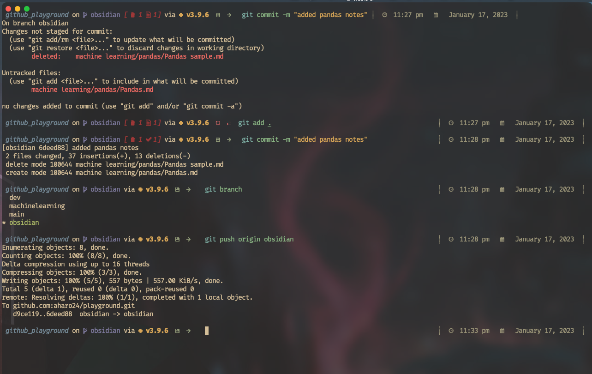
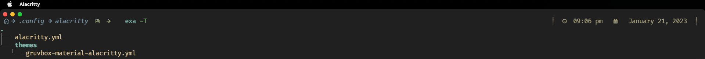

# Alacritty
Alacritty configuration, optimized for speed and efficiency. I've spent countless hours tweaking and fine-tuning.





---

# Requirement
Install `Homebrew`
```brew
/bin/bash -c "$(curl -fsSL https://raw.githubusercontent.com/Homebrew/install/HEAD/install.sh)"
```

# Installation with Homebrew

Step.1
Install alacritty: 
``` brew
brew install alacritty
```

Step.2 
Copy the alacritty.yml to `~/.config/alacritty/alacritty.yml`

#### [my alacritty file](https://github.com/aharo24/dot-alacritty/blob/main/resources/alacritty.yml)


---

### Shell Support
(I use [fish shell](https://fishshell.com/))

- Bash
- Cmd
- Elvish
- Fish
- Ion
- Nushell
- PowerShell
- Tcsh
- Xonsh
- Zsh


### color-scheme


##### [My colorscheme for alacritty in case you want to use it](https://github.com/aharo24/dot-alacritty/blob/main/resources/aharo24-gruvbox.yml)


---


# [How to Use](https://github.com/aharo24/opensource/tree/main/dotfiles) 
- Please refer to my opensource docs.
	- be patient (slowly merging notes and code)
.
.
.
I am excited to announce that I am in the process of updating my dot-alacritty repository. You can access it on my opensource GitHub page. This update includes improvements to thousands of lines of code across various programming languages and topics such as machine learning. Please bear with me as I work to merge my notes and code. Thank you for your patience!


---

# [Contact Info](https://github.com/aharo24/opensource)

Feel free to follow me on twitter: [@aharo24](https://www.twitter.com/aharo24)!


